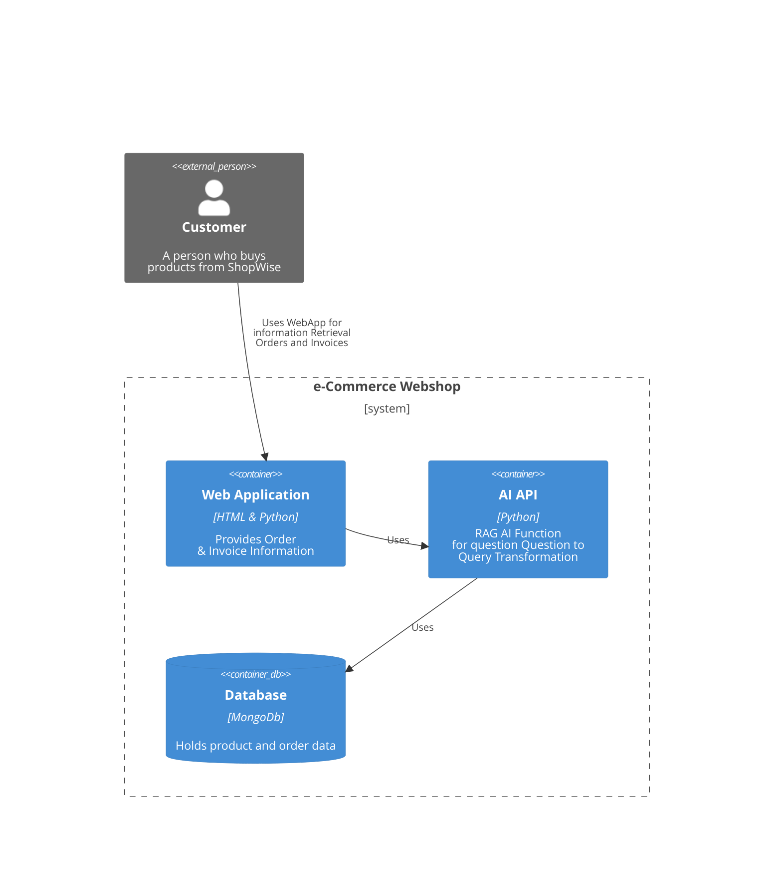
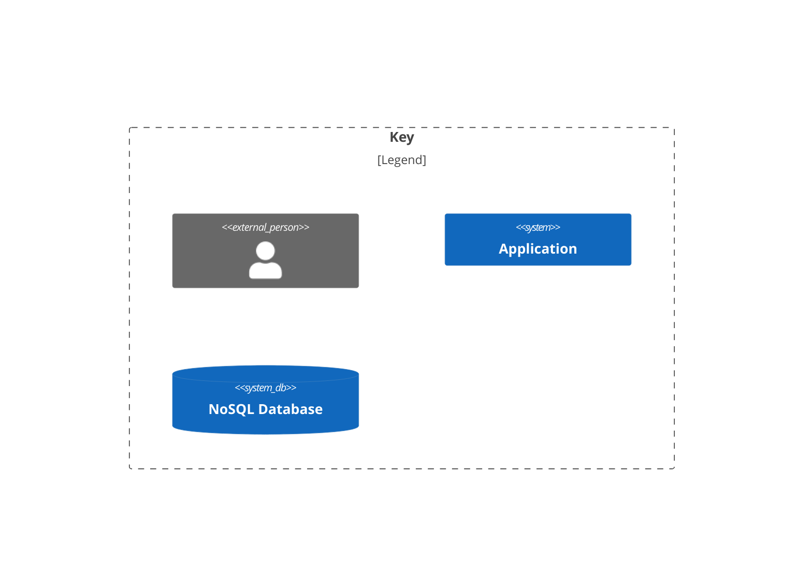

# Target Architecture
The architecture presented, focuses only on the Use of the AI assistant for retrieving information on Orders, Order Status and Product Availability in context of the Web Application.
Out of scope is the Webshop itself, where the orders can be placed.

This section describes the target software architecture described according [C4 Model](https://c4model.com).
Please note that all views are documented in C4 model style, although only System Context, Container and dynamic views are presented. The most diagrams use informal notation style. All diagrams are supplied with a key explaining meaning of each shape on the diagram.
### System Context
The system context diagram below depicted key Functionalities and interface to endusers and their dependencies.
The super simplified model shows 3 core components, which will be described in more detail later on. 

