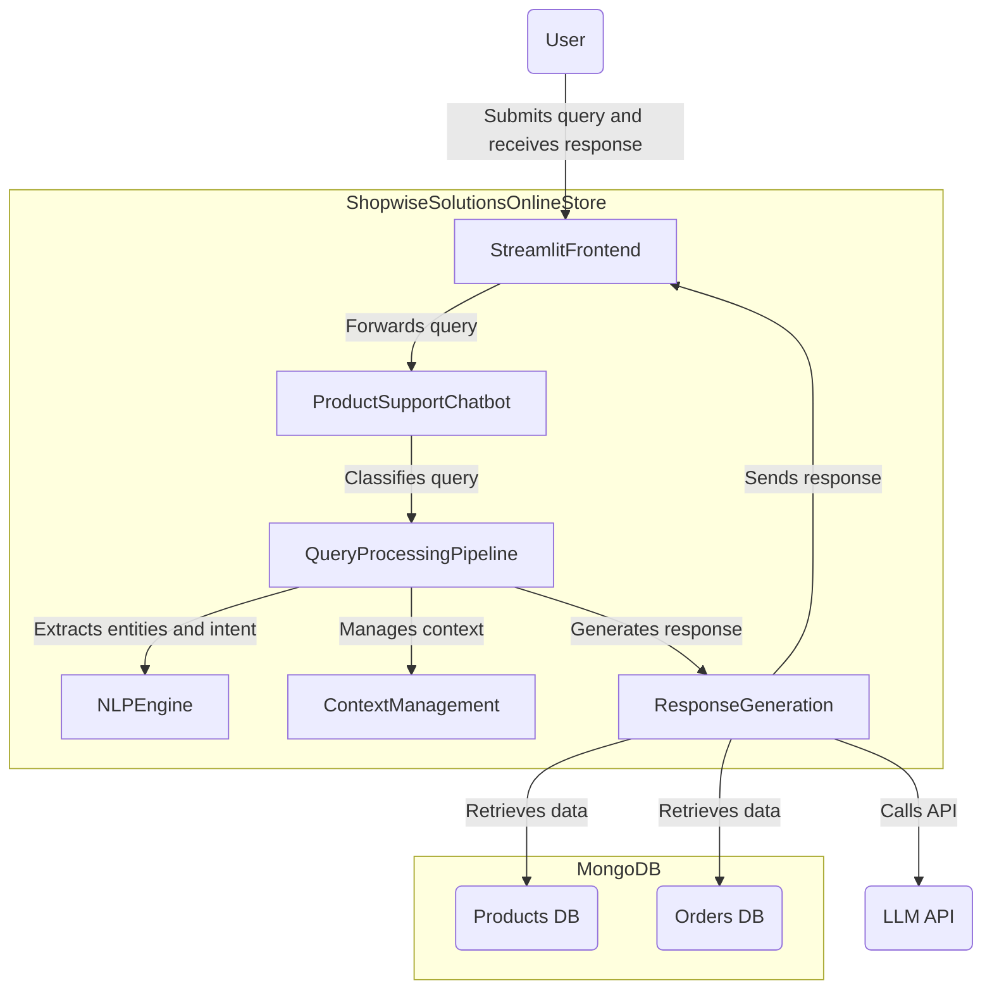
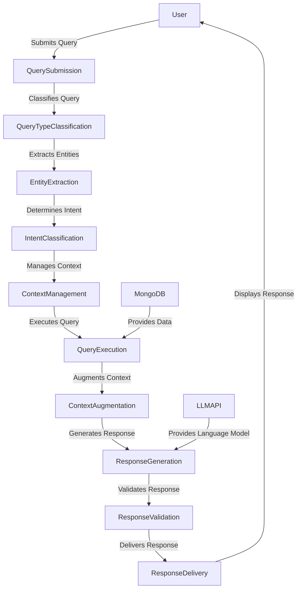
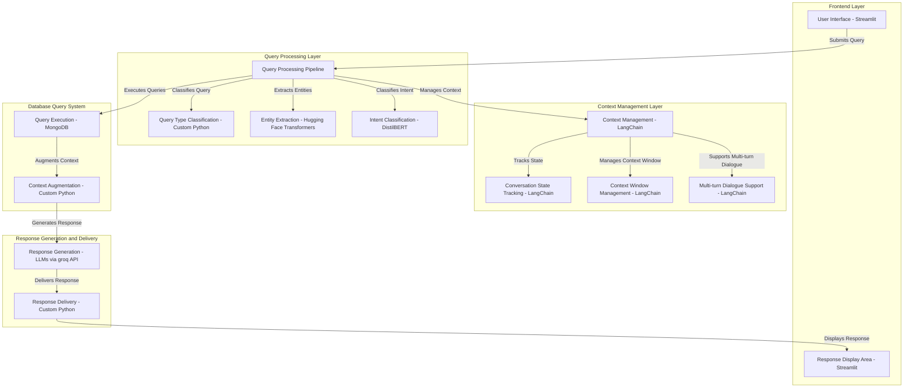

# RAG-Based Product Support Chatbot Implementation Plan

## Project Overview

### Objective

Build an AI-powered product support assistant for Shopwise Solutions' online store that serves as the first line of customer support for product inquiries, orders, returns, and refunds.

### Key Features

- Natural language understanding
- Database integration
- Personalized responses
- Multi-turn dialogue support
- Hallucination prevention
- Order management and tracking

### Technology Stack

- Frontend: Streamlit
- Backend: Python
- AI/ML: RAG (Retrieval-Augmented Generation), LLMs
- Database: MongoDB
- NLP: Hugging Face Transformers, DistilBERT
- Conversation Management: LangChain

## System Architecture

### Frontend Layer (Streamlit)

- Query type selector (radio buttons for product/order)
- Chat input interface
- Response display area

### Backend Layer

#### Query Processing Pipeline

- Query Type Classification
- Entity Extraction
- Intent Classification
- Context Management
- Response Generation
- Response Delivery

### Database Query System

- Query Execution using MongoDB
- Context Augmentation
- Response Generation with LLMs via groq API

## Core Components

### NLP Engine

- Entity extraction using Transformers
- Intent classification with DistilBERT
- Context parsing and maintenance

### Database Query System

- Queries product and order details from MongoDB
- Augments user input with retrieved data and context
- Integrates structured data with conversational context for nuanced responses

### Dialogue Management

- Conversation state tracking
- Context window management
- Multi-turn dialogue support

## Workflow Details

1. **Frontend Interaction**:

   - User submits a query through the Streamlit interface.
   - The system displays the response generated after processing.

2. **Backend Processing**:

   - **Query Processing Pipeline**:
     - Classifies query type (product/order).
     - Extracts entities and identifies intent.
     - Manages conversational context for multi-turn dialogue.
   - **Database Query System**:
     - Executes structured data queries in MongoDB based on intent and extracted entities.
     - Augments retrieved data with conversational context.
     - Generates a response using the LLM via the groq API.

3. **Response Delivery**:
   - The processed response is validated, delivered to the user interface, and displayed.

## Diagrams

## System Context Diagram

## Data Flow Diagram

## Architecture Diagram

