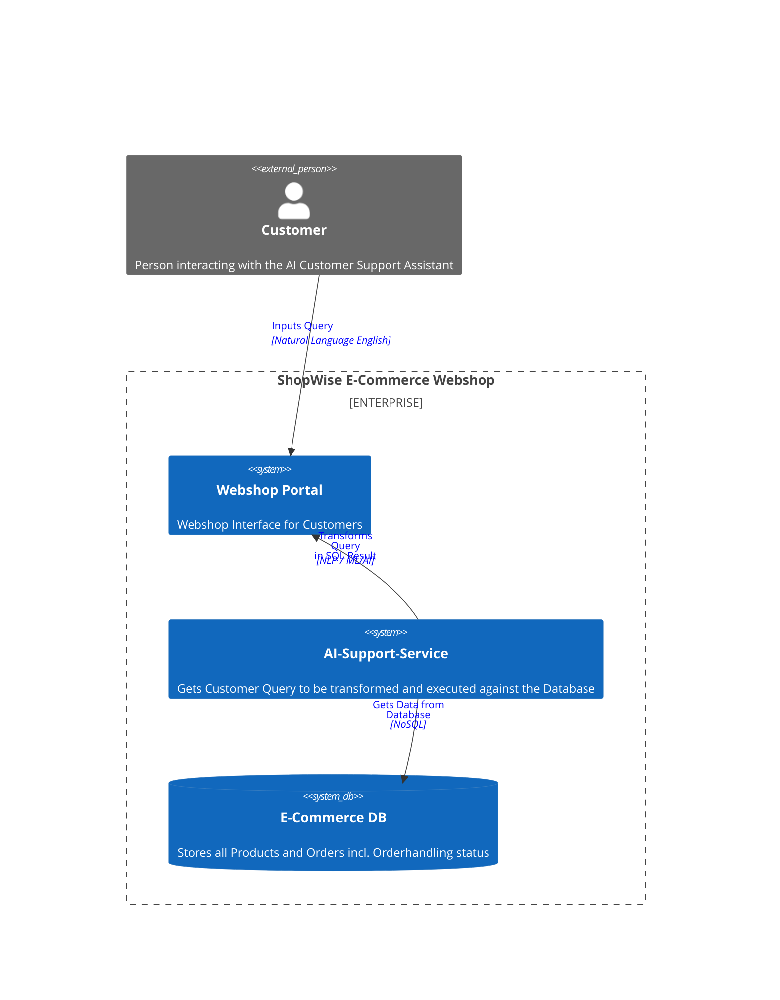

# ai-katas 2024

# Welcome to ShopWise Solutions
ShopWise Solutions is an innovative and fast-growing e-commerce company based in Austin, Texas, USA. Our online platform hosts a wide range of consumer products, spanning electronics, apparel, home goods, and much more. ShopWise Solutions has built a reputation for exceptional customer experience, streamlined order fulfillment, and a diverse catalog of quality products.
## Problem Description
ShopWise Solutions is now expanding into the realm of AI-driven customer service and is in need of a new AI-powered product support assistant for our online store. This assistant will serve as the first line of support for customer inquiries regarding products, orders, returns, and refunds, all by interfacing with our existing e-commerce database.

The assistant should be able to handle customer inquiries related to products and orders. It should be capable of natural language understanding, database integration, personalized responses, multi-turn dialogues, and avoidance of hallucinations. Additionally, it should be able to manage orders and track their status.
## Requirements
* ShopAssistant AI capabilities:
* Natural Language Understanding
* Database Integration
* Personalized Responses
* Multi-Turn Dialogues
* Avoidance of hallucinations
* Order Management
 

### System Context Shopwise Webshop
